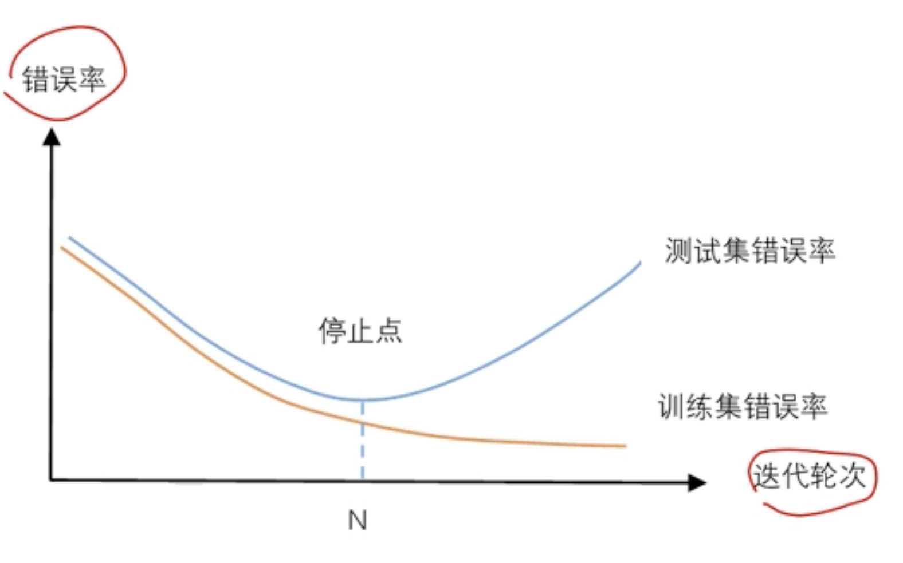

<font size = "6em" ><bold>**PA2: 情感分类(二分类)** &nbsp;&nbsp;</bold></font> <small>2021080070 计14 韩佑硕 </small> 

# 模型介绍
所有模型中embedding layer为单词的所对应的词向量。为此需提前生层Vocabulary。  
使用pytorch框架实现了。
## **CNN**
参考所提供的论文《Kim, Y. (2014). Convolutional Neural Networks for Sentence Classification. Proceedings of the 2014 Conference on Empirical Methods in Natural Language Processing (EMNLP 2014), 1746–1751》 设计了CNN模型。 主要为如下3个部分
- 卷积层  ： 3种 kernel，height分别为3,5,7。 个数均为20. 输入层分别通过这3种卷积层输出 kernel_num * 3个output channel。再用ReLU激活。
- 最大池化层  ： 对卷积后的每个output channel进行最大池化操作，1d。
- 全连接层  ： 把刚才的输出跟2个（number of classes）神经元全连接，会后进行log softmax。


## **RNN**
以 Bi-directional LSTM 实现了 recursive neural network.

- 双向双层 LSTM 层：接收某个 batch 的词向量组成的序列，每个 LSTM 单元在两个方向上分别产生自己的隐藏状态。最终只用了最后一层（第二层）两个方向上传播的各自的最后一个单元的隐藏状态作为下一层的输入。

## **MLP**
简单的MLP实现。
- mlp_layer : 接受embedding层的输出，拼接起来得到的张量，输出 hidden_size。之后进行bn,激活和池化


# 实验结果
## 模型对比
借助 wandb 实现了可视化。  
CNN, RNN_LSTM, MLP的训练、验证、测试集的准确率、损失、F-score为如下图所示。  


可得如下结果  
|  | CNN | RNN_LSTM | MLP|
| -------- | -------- | -------- | -------|
| Test Accuracy |  0.8591  | 0.8103   | 0.8347 |
| Test F-Score  | 0.8571   | 0.8099  | 0.8291 |
| Test Loss | 0.3971 | 0.8606 | 0.5887 |

# 不同参数的对比
在寻找最合适的 hyperparameter的过程当中，从 https://github.com/karpathy/char-rnn 中读到这样的原话。  
```plain text
Best models strategy
The winning strategy to obtaining very good models (if you have the compute time) is to always err on making the network larger (as large as you're willing to wait for it to compute) and then try different dropout values (between 0,1). Whatever model has the best validation performance (the loss, written in the checkpoint filename, low is good) is the one you should use in the end.

It is very common in deep learning to run many different models with many different hyperparameter settings, and in the end take whatever checkpoint gave the best validation performance.

By the way, the size of your training and validation splits are also parameters. Make sure you have a decent amount of data in your validation set or otherwise the validation performance will be noisy and not very informative.
```
虽然这是关于char-rnn的描述，但也跟我们的pa有一定的关联，故此对dropout rate和batch_size，learning_rate 等参数进行了比较，
所采用的模型是CNN，loss function 为 Cross Entropy function，优化器是Adam（default）。  
对于其他hyperparameter，设置为如下 (CNN)  
```python
    update_w2v = True           # whether to update w2v 
    vocab_size = len(vocab)+1   # +1 for padding (recall that we added one more row for sentence vector)
    n_classes = 2               # 0 -> neg, 1 -> pos | binary classification
    embedding_dim = 50          # dimension of word embedding. same as word2vec model length 50
    dropout_rate = 0.5 or 0.3   # dropout rate
    kernel_num = 20             # number of each kind of kernel
    kernel_sizes = [3,5,7]      # size of kernel, h (window size)
    pretrained_embed = s_vectors# pretrained embedding matrix
    #---------------------------- RNN&MLP ------------------------------------
    hidden_size = 100           # hidden size of rnn
    num_layers = 2              # number of layers of rnn
```
1. dropout_rate
    在所提供的论文中，dropout 设置为了0.5, 故此对 0.3、0.4、0.5 和 0.6 dropout rate 做了比较  
     . 
    最终发现CNN中，0.5是最恰当的droupout rate，由于资源的不足，对RNN和MLP也采用了相同的dropout rate。
2. epochs 
    通过多次实验发现，epoch超过15次，Test Accuracy 大概收敛到一定的值。故此，最终把epoch设置为15了。  
    并且最好的 Test Accuracy 在前10个epoch内获取，15次以后反而下降。  
    
3. 初始learning_rate
    用CNN 对 1e-2, 1e-3, 1e-4, 1e-5, 1e-6 的学习率进行了比较之后发现1e-3为最恰当的初始learning_rate.  
    
4. batch_size
    有些论文表明扩大batch size不一定提高准确率，反而降低学习率和batch size更提高准确率。
    ```plain text
    Our results concluded that a higher batch size does not usually achieve high accuracy, and the learning rate and the optimizer
    used will have a significant impact as well. Lowering the learning rate and decreasing the batch size will allow the network to train better,
    especially in the case of fine-tuning
    ``` 
    from （https://www.sciencedirect.com/science/article/pii/S2405959519303455?via%3Dihub ）  
    故此，把学习率设置为更小的数,同时减小batch size后返现原来的参数设置得到更好的结果。  
    

有一点遗憾的是，本人所用的device是cpu，若有时间和算力，就像上面所说的那样，想跑很多的runs，并求出最理想的 hyperparameter设置。 
并且各个hyperparameter最终理想设置受被决定循序的影响，这也由于资源的不足，没有考虑全。

# 效果差异
参考上面“模型对比”的结果可知， 
- CNN : Test loss 收敛最快且低，Validation Accuracy保持升高的状态，最终收敛于一定的值。虽然Test Accuracy的波动程度大，Train Loss值最后收敛值最高，但最终准确率和 Test F-score最高
- RNN : 虽然 Train loss 值最低，但Validation Accuracy下降的时机太早，Test Accuracy也收敛最慢且低，Test Loss收敛值最大。
- MLP : Test Accuracy 收敛最快但不比CNN高。Test Loss 适中， validation Accuracy开始下降的时机快且收敛值最低。

整体而言RNN和MLP都存在过拟合问题，MLP的Validation Accuracy更低，但Test Accuracy比RNN高。
看来最合适的model是CNN。

# 问题思考
**1） 实验训练什么时候停止是最合适的?**  
关于epoch的设置的话已经在上面阐述了，而至于如定规划停止策略，最关键的是过拟合问题。
首先我们可以想到使用验证集的策略。按照如下图设置停止点，可以得到性能理想的model。  

由于本次PA中，可以用wandb人工检查停止点，没涉及到pytorch的 early stopping callback。  
关于这个问题，调查发现有如下方案。

```plain text
“Some more complex triggers to stop training are as follows (note that they can also be applied in combination):

The observed metric has not improved over a given number of epochs (known as the early stopping patience).
The observed metric has not improved more than a given minimum change to be considered an improvement (known as the min_delta).”
```
来自 : (https://towardsdatascience.com/the-million-dollar-question-when-to-stop-training-deep-learning-models-fa9b488ac04d)


**2） 实验参数的初始化是怎么做的？不同的方法适合哪些地方？（现有的初始化方法为零均值初始化，高斯分布初始化，正交初始化等）**  
CNN，RNN，MLP的初始化分别为Kaiming Uniform, Kaiming Uniform, 高斯初始化。  

- Kaiming Uniform 初始化 : 适用于使用ReLU激活函数的卷积层的初始化，也是pytorch conv1d的默认初始方法。它会根据卷积核的尺寸和输入通道数，初始化权重值为在$[-\sqrt(k), \sqrt(k)]$之间均匀分布的随机数，其中k为卷积核的尺寸。  

- 零均值初始化 : 一种常见的参数初始化方法。每个权重都被初始化为从均值为0和标准差为1的正态分布中随机抽取的值。这种初始化方法的目的是使神经元的输出在训练开始时为零均值，以便更容易进行优化。还可以帮助避免梯度爆炸或消失的问题。  

- Normal initialization : 普遍的标准初始化，一般取期望 = 0， 方差 = 1。

- Xavier Initialization : 使用 Xavier 等方法理论上可以保证每层神经元输入输出数据分布方差一致，同样可以帮助避免梯度爆炸或消失的问题，有利于深度神的神经网络的学习。  
- He Initialization : 主要是想解决使用 ReLU 激活函数后，方差会发生变化的问题。只考虑输入个数时，He 初始化是一个均值为 0，方差为 2/n的高斯分布，适合于 ReLU 激活函数。其中 n 为网络层输入神经元数量个数。  

- Orthogonal initialization : 让权重矩阵满足正交矩阵的性质。正交初始化对于RNN中的循环权重非常有效。通过保持循环权重的正交性质，可以减少梯度消失或梯度爆炸问题，提高网络的学习能力和稳定性  
    正交初始化也可以用于卷积层中的卷积核权重初始化。由于卷积操作具有局部性质，权重之间的相关性较强。通过正交初始化，可以保持输入和输出之间的相关性，有助于提高特征提取能力和网络的表达能力。

关于正交初始化更深入的内容 :
- https://zhuanlan.zhihu.com/p/388398532
- https://arxiv.org/abs/2004.05867  

关于 Xavier and He Normal Initialization 更深入的内容 :
- https://arxiv.org/pdf/2004.06632.pdf
- http://proceedings.mlr.press/v9/glorot10a/glorot10a.pdf
- https://blog.51cto.com/armcvai/6031437

**3） 过拟合是深度学习常见的问题，有什么方法可以方式训练过程陷入过拟合。**  
这个方法已经在课堂中提了4种方法，简化模型、正则化、交叉验证、增加数据量.  
本人在此实验中，使用了简化模型(dropout rate)和交叉验证方法.  
其中最终的dropout rata已经在上面阐述了，验证集的大小已经决定。  
虽然CNN过拟合问题出现的不太严重，但RNN和MLP都存在了过拟合问题，程度不可忽视。  


**4） 试分析CNN，RNN，全连接神经网络（MLP）三者的优缺点**  
CNN、RNN、MLP的结果分别为如上表，模型对比在效果差异中。  
|  | CNN | RNN_LSTM | MLP|
| -------- | -------- | -------- | -------|
| Advantage |  可并行计算->计算速度快  | 输入长度可变   | 模型设计最简单，可并行计算 |
| Disadvantage  | 输入长度不可变，不可顾及前后文脉络  | 有序性->不能并行计算,容易产生梯度消失问题  | 输入长度不可变 |

# 心得体会
